# GapVisor

**AI recommendation visibility for B2B software teams.**

See how ChatGPT, Claude, Gemini, Perplexity, and connected AI APIs mention and recommend your brand versus named competitors — then act on gaps with prioritized content work and measurable experiments.

| | |
|---|---|
| **Live SPA** | [visibilityos.ensarresearch.com](https://visibilityos.ensarresearch.com/signin) |
| **Overview PDF** | [GapVisor-Overview.pdf](./GapVisor-Overview.pdf) |
| **UI snapshots** | [`docs/snapshots/`](./docs/snapshots/) |
| **API (local)** | `http://localhost:8000/docs` |
| **Free grader** | `/grader` (public, no login) |

---

## Product screens

> UI captures refreshed for **GapVisor** branding (sign-in, sidebar, grader, and all product routes).


| Sign-in | Workspace setup |
|:---:|:---:|
| 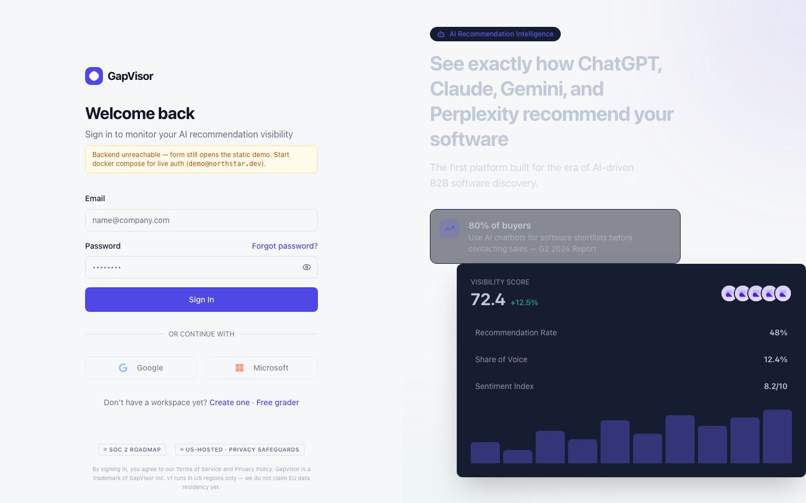 | 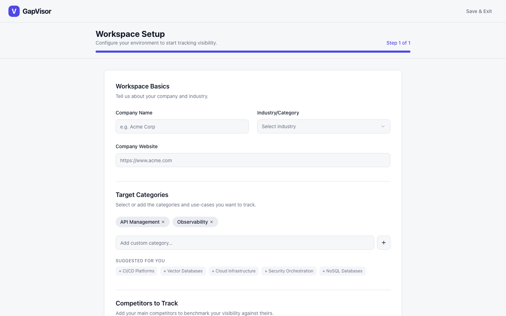 |

| Visibility dashboard | Model monitoring |
|:---:|:---:|
| 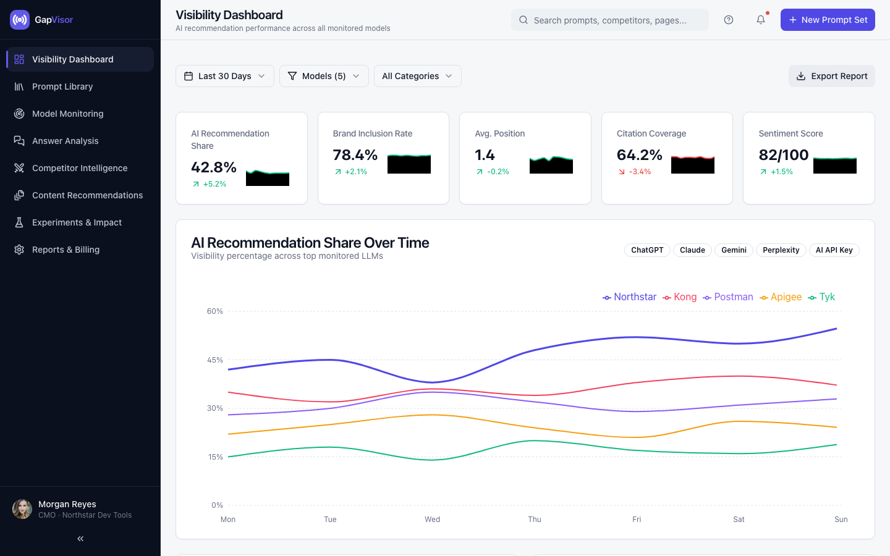 | 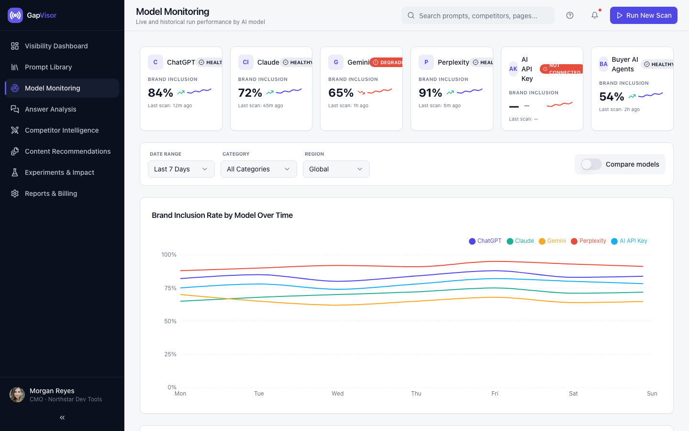 |

| Prompt library | Answer analysis |
|:---:|:---:|
| 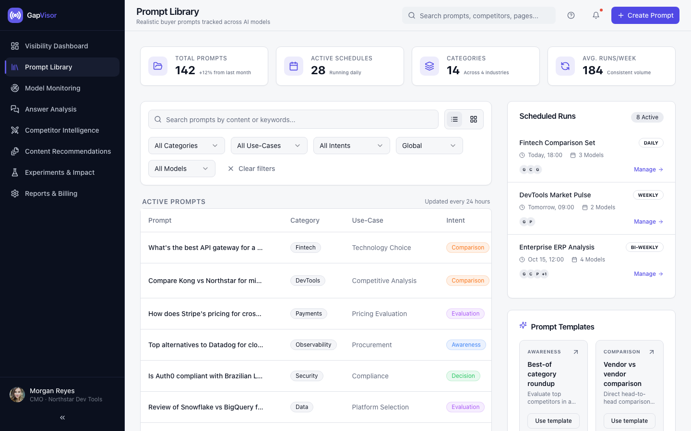 | 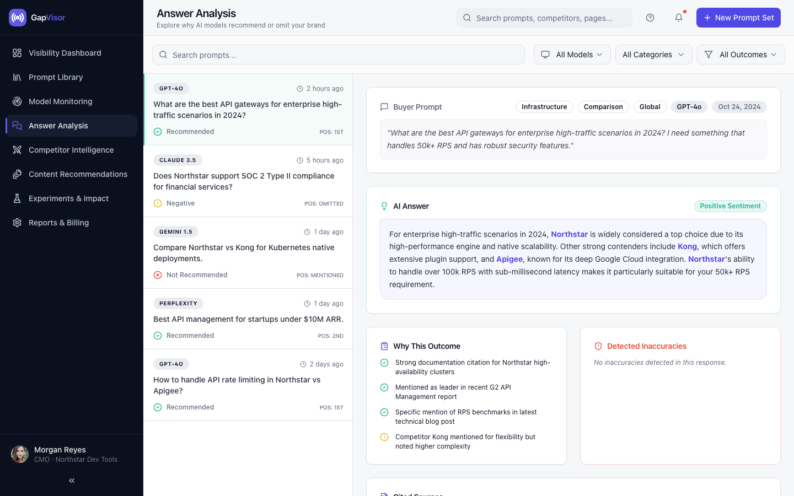 |

| Competitor intelligence | Content recommendations |
|:---:|:---:|
| 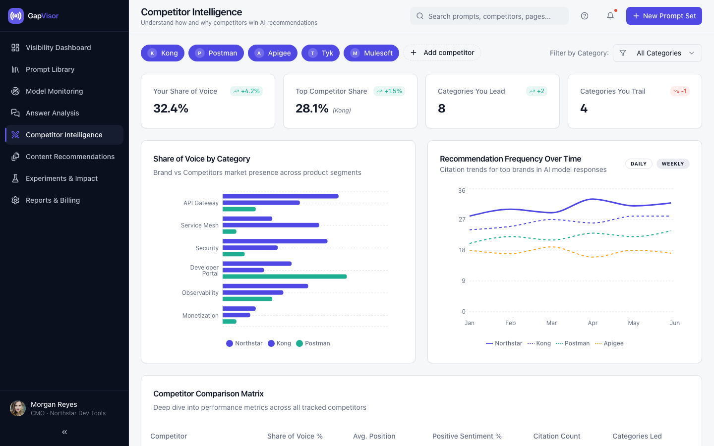 | 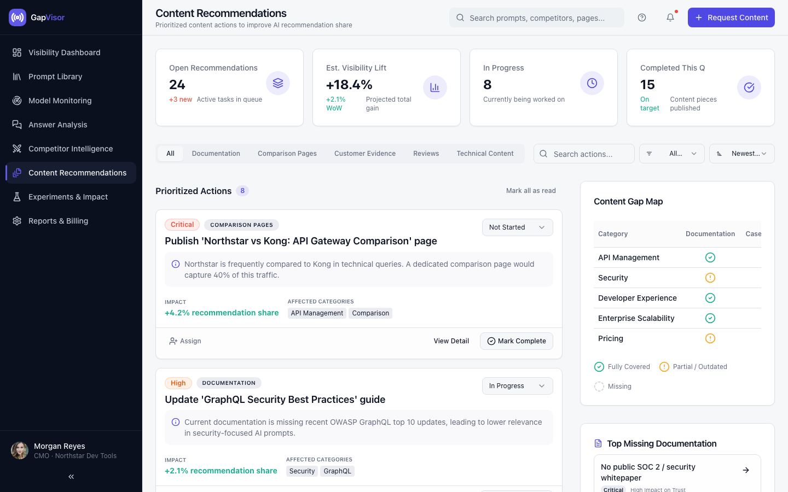 |

| Experiments & impact | Reports & billing |
|:---:|:---:|
| 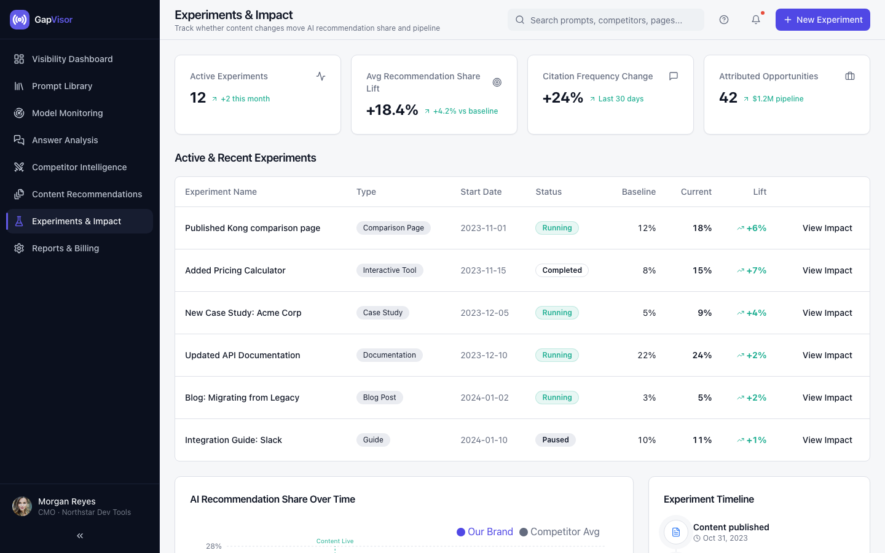 | 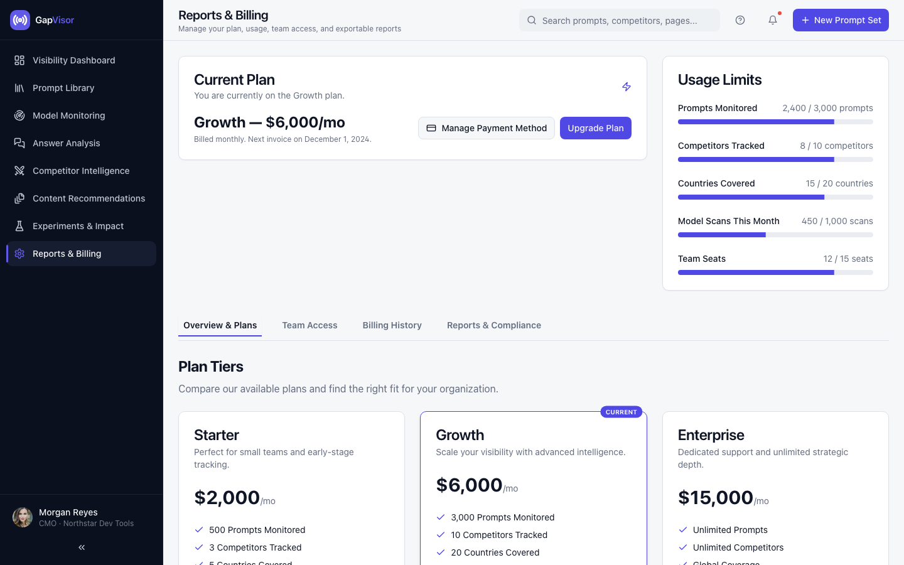 |

| Free Visibility Grader (GTM) |
|:---:|
| 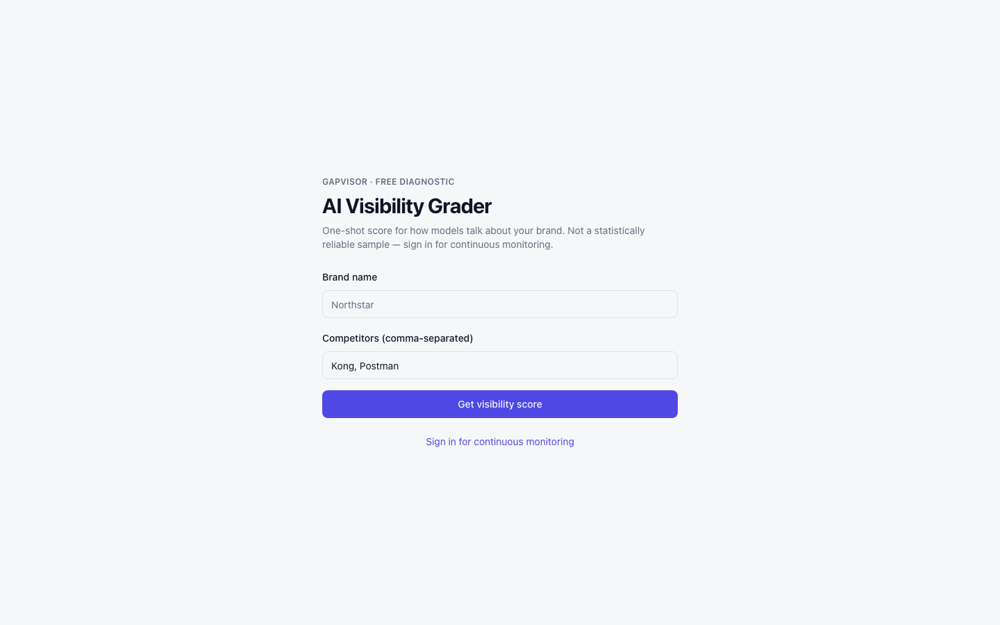 |

Colleague-ready walkthrough (4 pages, all screens above): **[GapVisor-Overview.pdf](./GapVisor-Overview.pdf)**

---

## What works today

| Capability | Status |
|---|---|
| 10-screen SPA (offline JSON demo + live API mode) | Done |
| Auth — register / login / refresh (Argon2id) | Done |
| Workspace — brand, competitors, categories, regions | Done |
| Prompt CRUD + scheduled sync mock scans | Done |
| Deterministic parse → `metric_daily` rollups | Done |
| Dashboard, monitoring, answers APIs | Done |
| Competitors overview, recommendations, experiments | Done |
| Confidence layer (`/confidence/*`) | Library + API |
| Free public grader (`/grader` + `/api/v1/public/grader`) | Mock |
| Billing usage stub | Done (no Stripe yet) |
| Phase specs `003`–`010` | Scaffolded |
| Live LLM adapters / S3 raw capture / Stripe / OAuth | Not yet |

### Demo credentials (seeded workspace)

```
demo@northstar.dev
VisibilityOS-Demo-2026!
```

---

## Stack

| Layer | Choices |
|---|---|
| Frontend | React 18 · Vite · TypeScript · shadcn/ui · TanStack Query |
| Backend | Python 3.12 · FastAPI · Postgres 16 (RLS) · Redis · Celery |
| Data path | scan → parse → `metric_daily` → composite dashboard APIs |
| Deploy (SPA) | CloudFront + S3 — live demo above |
| Deploy (API) | ECS / RDS planned |

---

## Quick start

**Prerequisites:** Docker Desktop (recommended), or local Postgres 16 + Redis 7, Node 20+, Python 3.12+.

```bash
# Full stack
docker compose up --build

# Or split processes
make be-dev   # FastAPI on :8000 (after migrate + seed)
make fe-dev   # Vite on :5173
```

| Service | URL |
|---|---|
| SPA | http://localhost:5173 |
| Free grader | http://localhost:5173/grader |
| OpenAPI | http://localhost:8000/docs |

Copy env templates if needed:

```bash
cp backend/.env.example backend/.env
cp frontend/.env.example frontend/.env
```

Useful Make targets: `make up` · `make down` · `make migrate` · `make seed` · `make test`

---

## Repository layout

```
GapVisor/
├── frontend/                 # React SPA (10 product screens + /grader)
├── backend/                  # FastAPI, Alembic, Celery, confidence + grader
├── docs/snapshots/           # UI PNGs used in README + overview PDF
├── GapVisor-Overview.pdf     # Internal colleague overview
├── DECISIONS.md              # Open product calls (FR-012, pricing)
├── PHASE-ROADMAP.md          # Phases 002–010 and dependencies
├── 002-backend-platform/ … 010-reconciliation-layer/
└── docker-compose.yml
```

---

## Phase roadmap (summary)

| Phase | Folder | Focus |
|---|---|---|
| Foundation | `002-backend-platform` | Auth → workspace → scan → metrics → commercial stubs |
| GTM / coverage | `003-gtm-and-coverage-enhancements` | Free grader, extra surfaces |
| Frontend polish | `004-frontend-design-fixes` | Presentation-only (parallel-safe) |
| Renewal loop | `005-insight-to-renewal-loop` | Recs → experiments → billing thread |
| Confidence | `006-confidence-layer` | Sample-size honesty / stats |
| Absorption | `007-absorption-funnel` | Crawl → mention funnel |
| Revenue | `008-revenue-thread` | Pipeline / CRM linkage |
| Causal lab | `009-experiment-lab` | Stronger causal experiments |
| Reconciliation | `010-reconciliation-layer` | Cross-source number checks |

Full dependency table and agent guidance: **[PHASE-ROADMAP.md](./PHASE-ROADMAP.md)**

---

## Open product decisions

See **[DECISIONS.md](./DECISIONS.md)**.

1. **FR-012** — Growth-tier scan commitment (`rotating_weekly` provisional vs `hard_daily`)
2. **Pricing lane** — Billing UI ($2k / $6k / $15k) vs case-study mid-market ($99–$299); engineering meters on **prompt quotas** until Stripe products are defined

---

## Artifacts

| Artifact | Description |
|---|---|
| [GapVisor-Overview.pdf](./GapVisor-Overview.pdf) | 4-page internal overview with feature screenshots |
| [docs/snapshots/](./docs/snapshots/) | Full-resolution UI captures (sign-in → grader) |
| [DECISIONS.md](./DECISIONS.md) | Product decisions still open or provisional |
| [PHASE-ROADMAP.md](./PHASE-ROADMAP.md) | Phase order, parallelism, whitespace rationale |
| `002-…` / `010-…` | Per-phase `spec.md` (and full kit under `002`) |

---

## License

Proprietary — internal / confidential unless otherwise stated by the owners.
